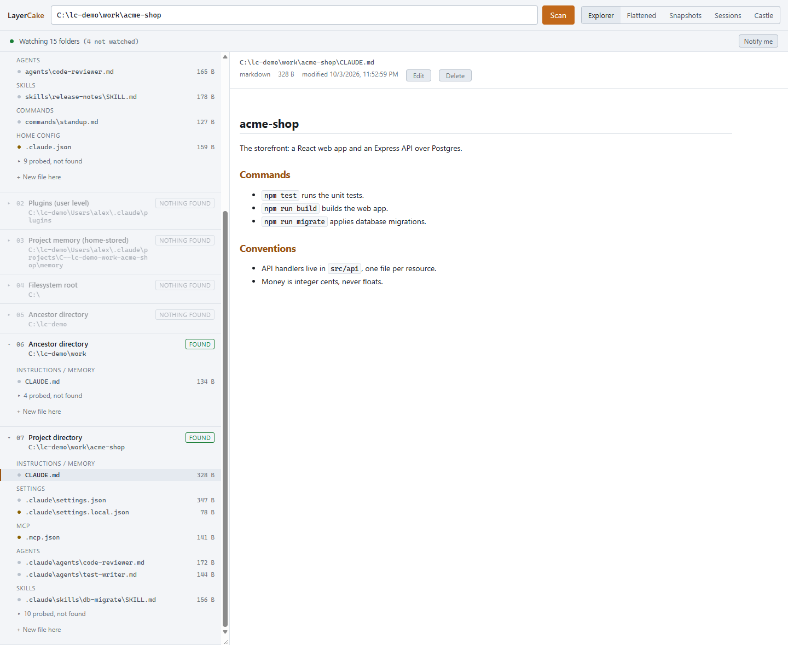
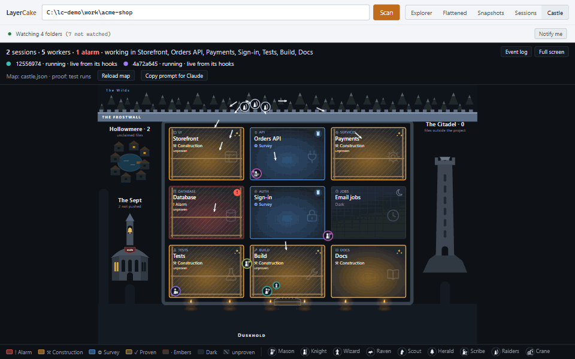
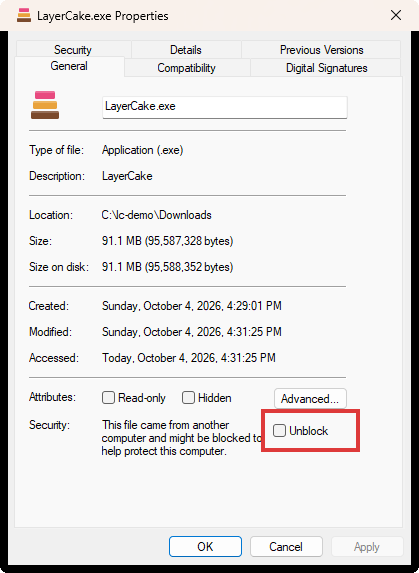
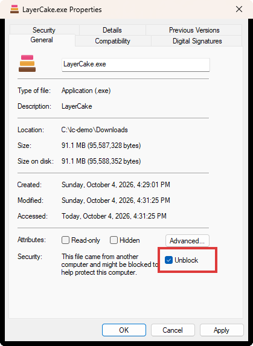

# LayerCake

See which Claude Code configuration applies to a project folder, where each piece comes from, and
which one wins. Edit those files safely, with a backup taken before every change, and roll back to
any earlier state.



Claude Code reads its configuration from many places: a managed policy, your user folder, plugins,
and every folder from the drive root down to your project. LayerCake scans them all for one project
and shows you:

- **The lineage:** each level in order, what it holds, and what was looked for and not found.
- **What actually applies:** the CLAUDE.md files in the order Claude reads them, the merged settings
  with the rule that merged them, and the agents, skills, commands and MCP servers in effect,
  including any that another one shadows.
- **Safe editing:** edit, create or delete a configuration file. A snapshot is taken first, and the
  Snapshots tab compares any snapshot with what is on disk now and restores it.
- **Change alerts:** a note when a configuration file changes on disk while LayerCake is open.
- **Sessions:** your Claude Code sessions in that project, with their prompts, context use and health.
- **The Castle:** a live picture of Claude at work, where each part of your project is a room that
  lights up as Claude reads, edits and tests it.



LayerCake runs on Windows 11; Windows 10 should work but has not been tested. It is an independent
project, not made by or affiliated with Anthropic.

## Get started

1. Download **LayerCake.exe** from the
   [latest release](https://github.com/HoustonDonald/LayerCake/releases/latest).
2. Unblock it. Windows marks a file downloaded from the internet, and because LayerCake is not
   code-signed, that mark makes Windows stop it on first run. To clear the mark:
   1. Right-click **LayerCake.exe** and choose **Properties** (or select it and press Alt+Enter).
   2. On the **General** tab, at the bottom, tick **Unblock**.
   3. Click **OK**.

    

   No **Unblock** checkbox means the file has no mark, and there is nothing to do. In PowerShell,
   `Unblock-File .\LayerCake.exe` does the same thing.
3. Double-click it. There is nothing to install. Its window opens in Edge, which comes with Windows
   (Chrome works too).
   - If you skipped step 2, Windows may say **"Windows protected your PC"**. Click **More info**, then
     **Run anyway**.
4. In the LayerCake window, type a project folder, such as `C:\dev\my-project`, and press **Scan**.

Close the window to stop LayerCake.

To check your download, compare its SHA-256 with the one listed on the release page. In PowerShell:

```
Get-FileHash .\LayerCake.exe
```

## What it does on your machine

- **Stays local, and yours.** It serves its page on `127.0.0.1` only and makes no network requests.
  Other people signed in to the same computer cannot use your LayerCake: each run has a new
  address and a new key, which only your own window is given.
- **Reads** your Claude Code configuration files. It never opens credential files
  (`.credentials.json`, `credentials.json`, `.env`, `.env.local`).
- **Changes your configuration only when you ask** (save, create, delete or restore), and takes a
  snapshot first. Its own data stays in `%LOCALAPPDATA%\LayerCake`. Snapshots are kept for 30
  days in `%LOCALAPPDATA%\LayerCake\snapshots`. They can include files that hold sign-in tokens,
  such as `~\.claude.json`, so keep that folder private, as you would the originals.
- **Spends none of your Claude usage**, except the optional AI summary of a session, which runs only
  when you click for it (Claude Haiku, with a spending cap).
- **Start Claude here** (on the Sessions tab) opens Claude Code in Windows Terminal with a status
  line and hooks that report to LayerCake on `127.0.0.1`, so it can show when Claude is waiting for
  you. Nothing is added to your own Claude Code settings. Sessions you start yourself are only read,
  from Claude Code's own session files.

The detail is in the reference: [Network posture](docs/reference.md#network-posture) and
[Write posture](docs/reference.md#write-posture).

## Remove it

Delete `LayerCake.exe` and the folder `%LOCALAPPDATA%\LayerCake`, which holds its snapshots, its own
data and its window's browser profile.

## If something goes wrong

- **A page saying it does not have LayerCake's key:** it was opened from an old window or a bookmark.
  LayerCake uses a new address every time it starts; open it again from `LayerCake.exe`.
- **The exe shows no details:** it has no console. Run it from source (below) with `npm run app` to
  see the same server's output.
- **Hook errors in a Claude session you started from LayerCake:** that session reports to LayerCake,
  so once LayerCake is closed Claude Code shows a hook error for each tool call. They are harmless:
  Claude does not see them and no usage is spent. Open LayerCake again, or start new sessions
  yourself.
- **Found a bug?** Open an issue with the Bug report form. Support is best effort, from one person;
  [SUPPORT.md](SUPPORT.md) says what is supported and how to contribute. For a security problem,
  see [SECURITY.md](SECURITY.md) instead.

## Run from source

You need [Node.js](https://nodejs.org) 20.19 or later (on Node 22, 22.12 or later) and Git.

```
git clone https://github.com/HoustonDonald/LayerCake.git
cd LayerCake
npm install
npm run app
```

`npm run app` builds the page, starts LayerCake and opens its window. Running from source also gives
you the command line tool, which answers without opening a window:

```
npm run cli -- here C:\dev\my-project     what applies in that folder, in about 20 lines
npm run cli -- tree C:\dev\my-project     every level and its files
```

The other commands are listed in the [reference](docs/reference.md#requirements). To build your own
`LayerCake.exe`, run `npm run build:exe` (Windows only; it lands in `dist\`). The test suite is
`npm run smoke`.

## More

- [Full reference](docs/reference.md): everything it scans, every view, and every known limit.
- [Support](SUPPORT.md): what to expect, what is supported, and how to contribute.
- [Security policy](SECURITY.md): how to report a vulnerability.
- [MIT License](LICENSE).
